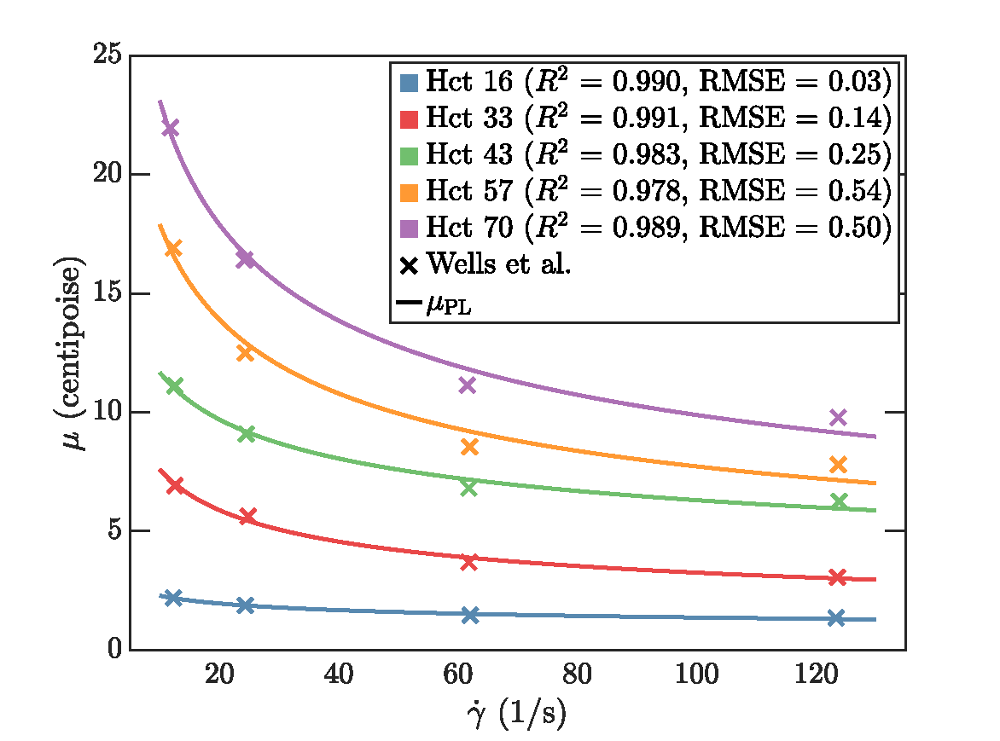
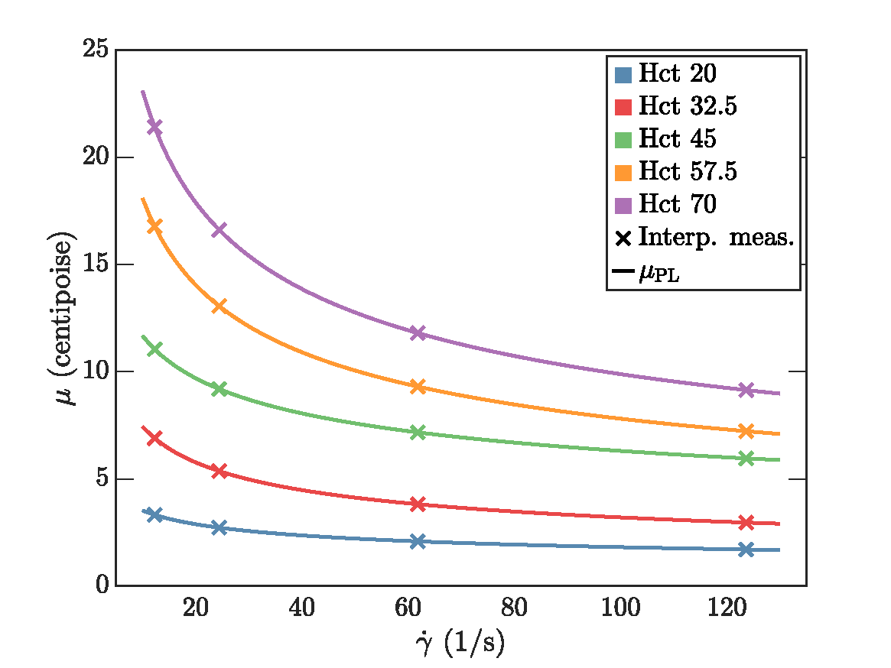
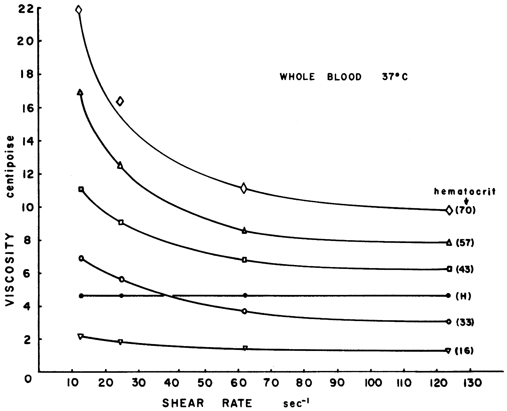

# Power-law Parameters

This repository contains viscosity data and fitting functions used to derive the power-law models reported in \[1].

  
  

## Viscosity measurements
Viscosity measurements at physiological temperatures (37C degrees) for a wide range of hematocrit values were obtained from [2] using the  software <a href="https://automeris.io/">Web Plot Digitizer</a> software.

## Citing
If you have used the provided codes for your research, or it has influenced your work, we ask that you include the following citations:

1. H. Mella, F. Galarce, T. Sekine, J. Sotelo, and E. Castillo, “Evaluating the impact of blood rheology in hemodynamic parameters by 4D flow MRI in large vessels considering the hematocrit effect,” *Biomedical Signal Processing and Control*, vol. 111, p. 108145, Jan. 2026. [https://doi.org/10.1016/j.bspc.2025.108145](https://doi.org/10.1016/j.bspc.2025.108145)

2. R. E. Wells and E. W. Merrill, “Influence of Flow Properties of Blood Upon Viscosity-Hematocrit Relationships,” *Journal of Clinical Investigation*, vol. 41, no. 8, pp. 1591–1598, Aug. 1962. [https://www.jci.org/articles/view/104617](https://www.jci.org/articles/view/104617)